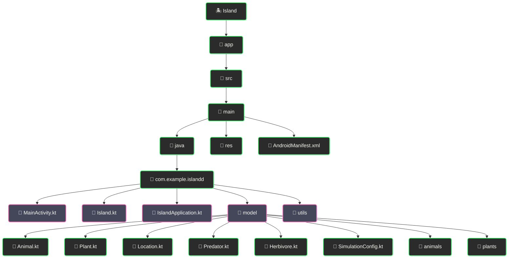

# 🏝️ Island - Симулятор экосистемы острова

  
  
  

  
  
  

<!-- 🌊 ДЕКОРАТИВНЫЙ РАЗДЕЛИТЕЛЬ 🌊 -->

  

## 🏝️ Симуляция экосистемы острова с животными и растениями

## 📋 О проекте

<h3><i>Наблюдайте за естественной эволюцией экосистемы!</i></h3>

Island - это интерактивная симуляция экосистемы острова, где различные виды животных и растений взаимодействуют друг с другом. Проект демонстрирует базовые принципы экологии, пищевые цепочки и баланс в природе. Построенный на Kotlin и Android, симулятор предлагает наглядный и интересный способ изучения взаимодействия видов в ограниченной среде.

<!-- 🐾 ДЕКОРАТИВНЫЙ РАЗДЕЛИТЕЛЬ 🐾 -->

  

### ✨ Основные возможности

<table style="min-width: 300px; width: auto; max-width: 100%; overflow-x: auto; display: block;">
  <tr>
    <th align="center">🌟 Функция</th>
    <th align="center">📝 Описание</th>
  </tr>
  <tr>
    <td align="center"><b>🏝️ Симуляция экосистемы</b></td>
    <td>Комплексная модель взаимодействия животных и растений</td>
  </tr>
  <tr>
    <td align="center"><b>🐺 15 видов животных</b></td>
    <td>Хищники и травоядные животные с уникальными параметрами</td>
  </tr>
  <tr>
    <td align="center"><b>🌿 Растительный мир</b></td>
    <td>Растения как источник пищи и ресурс для выживания</td>
  </tr>
  <tr>
    <td align="center"><b>📊 Статистика в реальном времени</b></td>
    <td>Наблюдение за изменениями популяций в каждый момент</td>
  </tr>
  <tr>
    <td align="center"><b>🔄 Природные циклы</b></td>
    <td>Движение, питание, размножение и смерть существ</td>
  </tr>
  <tr>
    <td align="center"><b>📱 Удобное управление</b></td>
    <td>Запуск, остановка и настройка симуляции одним касанием</td>
  </tr>
</table>

<!-- 🌅 ДЕКОРАТИВНЫЙ РАЗДЕЛИТЕЛЬ 🌅 -->

  

## 🚀 Технологический стек

<b>⚡ Используемые технологии</b>

 

| 💻 Технология | 📝 Описание |
|---------------|-------------|
| Kotlin | Современный язык программирования для Android |
| Android SDK | Набор инструментов для разработки Android-приложений |
| Material Design | Система дизайна с современными компонентами UI |
| Coroutines | Управление асинхронными операциями в приложении |
| Kotlin Reflection | Интроспекция классов для динамической работы |
| Jetpack | Набор библиотек для современной Android-разработки |
| View Binding | Безопасная работа с UI-компонентами |
| ExecutorService | Многопоточная обработка симуляции |

<!-- 🦊 ДЕКОРАТИВНЫЙ РАЗДЕЛИТЕЛЬ 🦊 -->

  

## 🎯 Для пользователей

<kbd>

</kbd>

  

<table style="min-width: 300px; width: auto; max-width: 100%; overflow-x: auto; display: block;">
  <tr>
    <th align="center">👥 Кому пригодится</th>
    <th align="center">📝 Преимущества</th>
  </tr>
  <tr>
    <td align="center">👨‍🏫 Преподаватели</td>
    <td>Наглядная демонстрация экологических процессов</td>
  </tr>
  <tr>
    <td align="center">👩‍🔬 Биологи</td>
    <td>Моделирование взаимодействия видов в контролируемой среде</td>
  </tr>
  <tr>
    <td align="center">👨‍💻 Разработчики</td>
    <td>Пример реализации сложной симуляции на Kotlin</td>
  </tr>
  <tr>
    <td align="center">👧 Учащиеся</td>
    <td>Интерактивное изучение экологических систем</td>
  </tr>
</table>

<!-- 🌺 ДЕКОРАТИВНЫЙ РАЗДЕЛИТЕЛЬ 🌺 -->

  

## ⚙️ Установка

### Системные требования

<table style="min-width: 300px; width: auto; max-width: 100%; overflow-x: auto; display: block;">
  <tr>
    <th align="center">🖥️ Требование</th>
    <th align="center">⚙️ Минимум</th>
    <th align="center">🚀 Рекомендуется</th>
  </tr>
  <tr>
    <td align="center">Android SDK</td>
    <td align="center">API 24 (Android 7.0)</td>
    <td align="center">API 34 (Android 14)</td>
  </tr>
  <tr>
    <td align="center">Kotlin</td>
    <td align="center">1.8.0</td>
    <td align="center">1.9.0+</td>
  </tr>
  <tr>
    <td align="center">Gradle</td>
    <td align="center">7.0</td>
    <td align="center">8.0+</td>
  </tr>
</table>

### Пошаговая установка

<table style="min-width: 300px; width: auto; max-width: 100%; overflow-x: auto; display: block;">
  <tr>
    <th colspan="2" align="center">🚀 Установка проекта</th>
  </tr>
  <tr>
    <td align="center" width="70"><b>1️⃣</b></td>
    <td>
      <b>Клонируйте репозиторий</b> 
      <code>git clone https://github.com/yourusername/island.git</code> 
      <code>cd island</code>
    </td>
  </tr>
  <tr>
    <td align="center"><b>2️⃣</b></td>
    <td>
      <b>Откройте в Android Studio</b> 
      <code>File -> Open -> [выберите папку проекта]</code>
    </td>
  </tr>
  <tr>
    <td align="center"><b>3️⃣</b></td>
    <td>
      <b>Соберите проект</b> 
      <code>./gradlew build</code> или используйте кнопку Run в Android Studio
    </td>
  </tr>
  <tr>
    <td align="center"><b>4️⃣</b></td>
    <td>
      <b>Запустите на устройстве/эмуляторе</b> 
      Выберите целевое устройство и нажмите Run
    </td>
  </tr>
</table>

<!-- 🌲 ДЕКОРАТИВНЫЙ РАЗДЕЛИТЕЛЬ 🌲 -->

  

## 🔧 Разработка

### Структура проекта

### Сборка и тестирование

<table style="min-width: 300px; width: auto; max-width: 100%; overflow-x: auto; display: block;">
  <tr>
    <th align="center">🛠️ Действие</th>
    <th align="center">💻 Команда</th>
  </tr>
  <tr>
    <td align="center">Сборка проекта</td>
    <td><code>./gradlew build</code></td>
  </tr>
  <tr>
    <td align="center">Запуск тестов</td>
    <td><code>./gradlew test</code></td>
  </tr>
  <tr>
    <td align="center">Создание APK</td>
    <td><code>./gradlew assembleDebug</code></td>
  </tr>
  <tr>
    <td align="center">Очистка проекта</td>
    <td><code>./gradlew clean</code></td>
  </tr>
</table>

<!-- 🦌 ДЕКОРАТИВНЫЙ РАЗДЕЛИТЕЛЬ 🦌 -->

  

## 📧 Контакты

<table style="min-width: 300px; width: auto; max-width: 100%; overflow-x: auto; display: block;">
  <tr>
    <th align="center">📱 Контакт</th>
    <th align="center">🔗 Ссылка</th>
  </tr>
  <tr>
    <td align="center">📧 Email</td>
    <td align="center"><a href="mailto:reazonvan206@gmail.com">reazonvan206@gmail.com</a></td>
  </tr>
  <tr>
    <td align="center">💬 Telegram</td>
    <td align="center"><a href="https://t.me/reazonvan">@reazonvan</a></td>
  </tr>
  <tr>
    <td align="center">🌐 GitHub</td>
    <td align="center"><a href="https://github.com/ReazonVan">ReazonVan</a></td>
  </tr>
</table>

<!-- 🐝 ДЕКОРАТИВНЫЙ РАЗДЕЛИТЕЛЬ 🐝 -->

  

## 🤝 Поддержка проекта

<kbd>

</kbd>

---

  
<h1>🏝️ Island - Наблюдайте за эволюцией экосистемы! 🌿</h1>

 